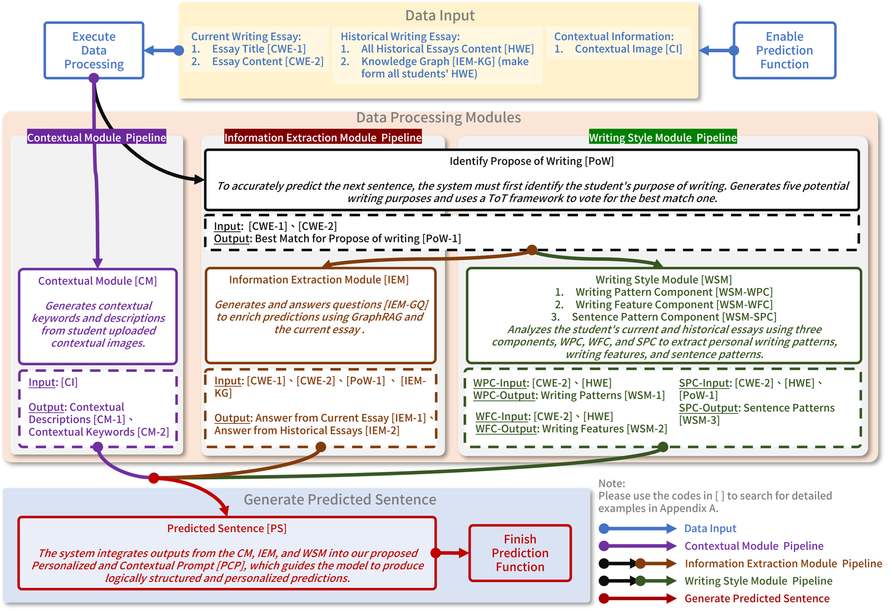

# Preliminary Investigation of Personalized Next-Sentence Prediction for EFL Writing with Authentic Context and Personalized Writing Portfolio

[](https://www.python.org/downloads/release/python-3120/)
[](https://opensource.org/licenses/MIT)

This repository contains the implementation of the NSP-PCP pipeline. This research explores the integration of **GraphRAG** and **Personalized Contextual Prompts (PCP)** to improve Next-Sentence Prediction (NSP) in narrative writing.

---

## 📖 Introduction

Next-sentence prediction (NSP) for English as a Foreign Language (EFL) writing support often lacks personalization and factual reliability. To address these limitations, this study proposes a personalized NSP with **Personalized and Contextual Prompt (NSP-PCP)** for writing assistants.

Traditional generative NSP systems often result in generic, statistically probable but uninspired sentences that fail to align with a user's specific intent. Our framework utilizes authentic contextual information and structured knowledge graphs to ground the generation process, ensuring that the predicted sentences are not only grammatically correct but also semantically relevant and stylistically consistent with the user's unique authorial agency.

---

## 🏗 System Architecture

The NSP-PCP system processes data through a structured pipeline composed of three novel modules, integrated via the **Tree of Thoughts (ToT)** framework and **Chain of Thought (CoT)** principles.



### Core Modules:

1.  **Contextual Module (CM)**: Extracts authentic context from user-provided images using multimodal LLMs. It generates keywords and descriptions that establish the theme and background for the narrative.
2.  **Information Extraction Module (IEM)**: Leverages [Microsoft GraphRAG](https://github.com/microsoft/graphrag) to retrieve factually reliable information from a shared knowledge base built from historical essays. It performs reasoning to fill in the current writing content.
3.  **Writing Style Module (WSM)**: Analyzes the author's unique writing patterns, features, and sentence structures from historical works to ensure the generated output reflects the user's writing style.

These modules' outputs are synergistically combined into the **Personalized and Contextual Prompt (PCP)**, which guides the primary model through a logical reasoning path to generate the final prediction.

---

## 🛠 System Setup

### 1. Database Initialization

This project requires a MySQL database. Use the scripts in `db-setup/` to initialize the environment:

- **Default Test Account**:
  - Account: `test`
  - Password: `test`

### 2. GraphRAG Preparation

The system relies on pre-indexed knowledge.

1. Use the official [Microsoft GraphRAG](https://github.com/microsoft/graphrag) to index your target corpus.
2. After indexing, copy the generated output folder into `backend/graphRAG/output/`.
3. The system will automatically detect the latest artifacts folder based on the last modification time.

### 3. Application Setup

```bash
cd backend
# Copy .env-template to .env and configure your GPT_API_KEY,LLM Model and DB settings
pip install -r requirements.txt
python main.py
```

---

## 📊 Evaluation Setup

The research proceeds in two stages to evaluate the design and impact of the system:

- **Alpha Test**: Focuses on establishing the technical stability of the system's prediction function. Including **Similarity** and **Correctness**.
- **Beta Test**: Conducted to observe system performance in real-use contexts. This stage utilizes the **G-Eval** Customized Metrics.

### 1. Data Preparation

Prepare a cleaned test dataset in CSV format in `evaluation/input/test-data.csv`. The required columns differ by test stage:

| Test Stage     | Required Columns                                                |
| :------------- | :-------------------------------------------------------------- |
| **Alpha Test** | `uid`, `true-sentences`, `predect-prompts`, `predect-sentences` |
| **Beta Test**  | `uid`, `predect-prompts`, `predect-sentences`                   |

### 2. Running Evaluation

The module utilizes [BGE-M3](https://github.com/FlagOpen/FlagEmbedding) for similarity and [DeepEval](https://deepeval.com/) for LLM-based metrics.

```bash
cd evaluation
# Copy .env-template to .env and set OPENAI_API_KEY and DeepEval Model
pip install -r requirements.txt
python evaluation.py
```

Results will be saved in `evaluation/output/`.

---

## 📄 License

This project is licensed under the **MIT License**. This license allows for reuse, modification, and distribution for academic purposes, provided that original authorship is credited.
